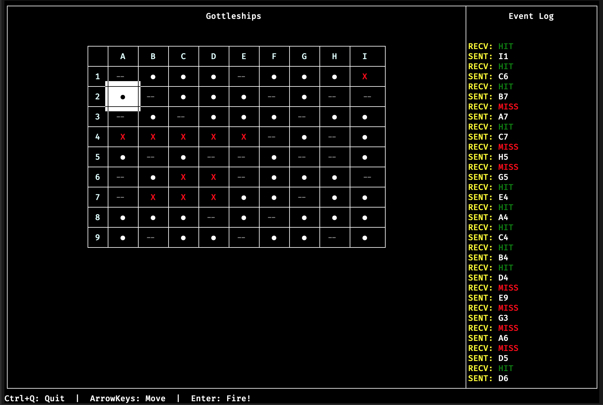

# Gottleships: Go(Ba)ttleships

Single player implementation of the Battleships game in Go with a client/server architecture that communicates over raw sockets, complete with a terminal based UI (TUI). I originally created Gottleships as part of an assignment for university.

## Building & Running

### Prerequisites

- The [`Go` programming language](https://golang.org/dl/)
- `$GOPATH` configured (generally `~/go/`).
- Access to the internet.
  - See [here](https://github.com/golang/go/wiki/GoGetProxyConfig) for information regarding configuring a proxy if required.

### Build the Application

Clone the repo. There are 2 ways to do this:

1. `go get github.com/jaymickey/gottleships`
    - `go get` *should* automatically run go install and place the `gottleships` binary in your `$GOPATH/bin` folder
2. `git clone (https://)(git@)github.com:jaymickey/gottleships.git $GOPATH/src/github.com/jaymickey/gottleships`
    - `cd $GOPATH/src/github.com/jaymickey/gottleships`
    - `go install`

### Running Gottleships

Go install will download any dependencies, build the binary, and copy it into `$GOPATH/bin`. If `$GOPATH/bin` is in your `$PATH` variable, then you should be able to simply run `gottleships`, along with the required flags.

#### Flags

| Flag      | Short | Required? | Default     | Description                                                   |
|-----------|-------|-----------|-------------|---------------------------------------------------------------|
| -mode     | -m    | Yes       |             | Application mode to launch. Valid input: `server` or `client` |
| -hostname | -h    | No        | `localhost` | The hostname to listen via or connect                         |
| -port     | -p    | No        | 8080        | The port number to listen or connect                          |
| -log      | -l    | No        | `Stdout`    | Location of file to write log output                          |
| -verbose  | -v    | No        | `false`     | Generate verbose log output                                   |

### Using startServer.sh & startClient.sh

`startServer.sh` will attempt to run `go get github.com/jaymickey/gottleships` if it does not detect that it has already been retreived. After which it will attempt to run the server. `startServer.sh` requires a single argument `[port]`, which can simply be provided in the form of a number. e.g. `startServer.sh 9000`.

Similarly, `startClient.sh` will also attempt to retreive to Gottleships package if it doesn't detect that it already exists. It requires two arguments - `[hostname]` and `[port]`. e.g. `startClient.sh localhost 9000`.

Both scripts will first attempt to run `gottleships ...`, if the application is not in your `$PATH` this will fail, after which they will attempt to run `$(go env GOPATH)/bin/gottleships ...`. If this also fails then you will need to troubleshoot your go installation.

## OSS

Gottleships utilises the following open source packages:

- [rivo/tview](https://github.com/rivo/tview) - Terminal-based UI components.
- [google/logger](https://github.com/google/logger) - Simple logging package with basic log levels and verbosity support.
- [spf13/pflag](https://github.com/spf13/pflag) - Basic command-line flag management that builds on top of the `flag` stdlib package.
- [stretchr/testify](https://github.com/stretchr/testify) - Simple testing and assertion framework.

Thanks to the creators of these libraries for their time and dedication in providing this software to the community.
